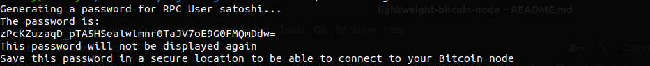

# Lightweight Bitcoin Node
A Docker build for a lightweight, low-disk usage, quick-to-start Bitcoin full node

This image allows anyone to start a Bitcoin node on any machine with one command.

The node is pruned by default, meaning that it will store up to 1GB of the blockchain. Aside from this the node needs to
store some chain-state data, so the total disk space needed is less than 10GB (compared to around 500GB normally).

Furthermore, to improve startup time, we take advantage of https://prunednode.today/ which stores a recent snapshot of 
the blockchain. This means that you can have a node fully up-to-date and running within a few hours or less, 
rather than days or weeks.

## Requirements

* docker
* 10GB of disk space
* an internet connection

## Usage

Start a container with the lightweight-bitcoin-node image.

It is highly recommended to bind the /data volume to some folder on your host machine.
This folder will hold all the necessary blockchain data, so by storing it on your host you won't have to re-download the 
blockchain when recreating the container.

On first startup, create an empty folder somewhere to store the block data, then run a command like below:

`docker run -v /home/YOUR_USER/YOUR_PATH:/data thebitcoinprof/lightweight-bitcoin-node`

Optionally, you can also expose the 8332 port to the host, allowing other applications such as wallets or Joinmarket
to connect to your Bitcoin node via RPC connections.

`docker run -p 8332:8332 -v /home/YOUR_USER/YOUR_PATH:/data thebitcoinprof/lightweight-bitcoin-node`

For maximum simplicity, run the container in the background (`-d`) and give it a human-readable name (`--name SOMENAME`)

`docker run -d -p 8332:8332 -v /home/YOUR_USER/YOUR_PATH:/data --name bitcoin-core thebitcoinprof/lightweight-bitcoin-node`

### Connecting to the node

If you expose the 8332 port, you can connect to your Bitcoin node via `localhost:8332`, by authenticating with the
user & password that were set. The default user is `satoshi` and a secure password is autogenerated. 

You can see what the password is by checking the very beginning of the docker logs

`docker logs bitcoin-core`

The logs should look something like this:

Alternatively, you can reset the RPC password by running the `resetRpcPassword.sh` script on the container

`docker exec bitcoin-core /bin/bash -c "/scripts/resetRpcPassword.sh"`

This will generate a new password for you, which will only be printed to the console, and not to the logs.
The Bitcoin node's configuration file will also be updated to use this new password.

Furthermore, you can change the RPC user by passing a `-u` argument

`docker exec bitcoin-core /bin/bash -c "/scripts/resetRpcPassword.sh -u myuser"`

This will change the RPC user in the Bitcoin node's configuration to `myuser` and generate a new, random password 
for that user as well.

IMPORTANT! Whenever you change the password (or user), make sure to restart the container to apply the changes

`docker restart bitcoin-core`

## Advantages of running (and using) a Bitcoin node

1. [You don't tell other people which transactions are yours](#dont-expose-your-transactions)
2. [You verify transactions yourself rather than trusting some
   (usually) unknown person to verify them for you](#dont-trust-verify)
3. [You contribute to the decentralisation and security of the whole Bitcoin network](#secure-the-network)
4. [You learn a lot about Bitcoin](#learn-about-bitcoin)
5. [You have something to brag about in front of your nerd friends](#bragging-rights)

### Don't Expose Your Transactions

Anytime you send some Bitcoin, the transaction has to be somehow propagated to 
the wider Bitcoin network, so that all participants, and especially miners, know about it and include it in the blockchain.

The only way for a transaction to enter the network is for it to be sent around by Bitcoin nodes.

When you, for example, send some Bitcoin from your Ledger (although you shouldn't ever do that because #HODL),
you enter the destination address, the amount, fees, etc., and then your wallet sends out this transaction to the
Bitcoin network.

However, since you don't have a Bitcoin node, your wallet will first send the transaction to the Ledger servers, 
which do have a Bitcoin node, and then from there your transaction will be propagated to the rest of the world.

This means that Ledger servers have a record of every transaction you make, tied to your IP. In practice this means that
the wallet you use is able to tie your identity to your transactions.

Unless you use your own Bitcoin node, your transactions are exposed.

### Don't Trust, Verify

Even if you use a noncustodial wallet, like Coinomi, Ledger, Bluewallet, etc., where you hold your own keys, you are still
relying on someone else to tell you how many coins you currently have in your wallet.

Every time you open your wallet, it asks, for example, the Ledger servers:

`"What is the balance of this Bitcoin wallet with these Bitcoin addresses?"`

And since the Ledger servers have a Bitcoin full node running, they can check this and tell your wallet to display
the appropriate amount.

If you aren't running a Bitcoin node yourself, you cannot know for sure that this balance is correct. You have to trust
Ledger that:

A) They aren't being malicious

B) They have not been hacked or otherwise compromised

C) They don't have a bug in their system

However, when you run your own node, you can point your wallet to use that as its point of reference, rather
than some unknown server run by a stranger. 

### Secure the Network

Bitcoin's security and resiliency from outside attacks relies largely on various forms of decentralisation.

One crucial aspect of Bitcoin's security is the fact that tens of thousands of network participants independently verify
blocks to eliminate any bad actors or faulty transactions. 

By running a Bitcoin node you help everyone by constantly checking that the Bitcoin network is functioning correctly.

Furthermore, you become yet another good actor in the space, making the network more resistant to hacker attacks and
tyrannical government crackdowns.

In order to take down the Bitcoin network, a bad actor would have to take down every single Bitcoin node. By adding one 
to the system, you make this even more impossible to do.

### Learn about Bitcoin

We all know that fully understanding how Bitcoin works is virtually impossible. It's quite normal to re-read the same 
article 5 times, in order to understand what a blockchain is.

Learning in practice, rather than in theory, is far more fun and effective. Running your own node allows you to 
learn a lot about how Bitcoin works, pretty much by accident. 

It is much easier than it sounds, and will make you much more confident when using Bitcoin and 
explaining it to your mother-in-law.

### Bragging Rights

Once you have that beautiful Bitcoin node running, you can talk to your Bitcoin friends with a justified tone
of superiority, since now you are officially, objectively, better than them.

Remember to turn every conversation into a purity test to try and determine who is a Real Bitcoiner.
You are sure to win every time.

## Donate

If you like this project and want to see more development, please consider donating to:

`bc1p9rmge4p43umvr9ulu3g25ve4m524d6mya2y5q8f69m929c9nctfsx5zc2k`

