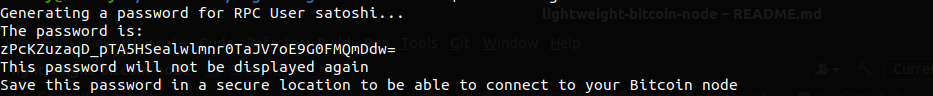

# Lightweight Bitcoin Node
A Docker build for a lightweight, low-disk usage, quick-to-start Bitcoin full node

This image allows anyone to start a Bitcoin node on any machine with one command.

The node is pruned by default, meaning that it will store up to 1GB of the blockchain. Aside from this the node needs to
store some chain-state data, so the total disk space needed is less than 10GB (compared to around 500GB normally).

Furthermore, to improve startup time, we take advantage of https://prunednode.today/ which stores a recent snapshot of 
the blockchain. This means that you can have a node fully up-to-date and running within a few hours or less, 
rather than days or weeks.

## Requirements

* docker
* 10GB of disk space
* an internet connection

## Usage

Start a container with the lightweight-bitcoin-node image.

It is highly recommended to bind the /data volume to some folder on your host machine.
This folder will hold all the necessary blockchain data, so by storing it on your host you won't have to re-download the 
blockchain when recreating the container.

On first startup, create an empty folder somewhere to store the block data, then run a command like below:

`docker run -v /home/YOUR_USER/YOUR_PATH:/data btc-node`

Optionally, you can also expose the 8332 port to the host, allowing other applications such as wallets or Joinmarket
to connect to your Bitcoin node via RPC connections.

`docker run -p 8332:8332 -v /home/YOUR_USER/YOUR_PATH:/data btc-node`

For maximum simplicity, run the container in the background (`-d`) and give it a human-readable name (`--name SOMENAME`)

`docker run -d -p 8332:8332 -v /home/user/YOUR_USER/YOUR_PATH:/data --name bitcoin-core btc-node`

### Connecting to the node

If you expose the 8332 port, you can connect to your Bitcoin node via `localhost:8332`, by authenticating with the
user & password that were set. The default user is `satoshi` and a secure password is autogenerated. 

You can see what the password is by checking the very beginning of the docker logs

`docker logs bitcoin-core`

The logs should look something like this:

Alternatively, you can reset the RPC password by running the `resetRpcPassword.sh` script on the container

`docker exec bitcoin-core /bin/bash -c "/scripts/resetRpcPassword.sh"`

This will generate a new password for you, which will only be printed to the console, and not to the logs.
The Bitcoin node's configuration file will also be updated to use this new password.

Furthermore, you can change the RPC user by passing a `-u` argument

`docker exec bitcoin-core /bin/bash -c "/scripts/resetRpcPassword.sh -u myuser"`

This will change the RPC user in the Bitcoin node's configuration to `myuser` and generate a new, random password 
for that user as well.

IMPORTANT! Whenever you change the password (or user), make sure to restart the container to apply the changes

`docker restart bitcoin-core`

## Advantages of running (and using) a Bitcoin node

1. You verify transactions yourself rather than trusting some
   (usually) unknown person to verify them for you.
2. You don't tell other people which transactions are yours
3. You contribute to the decentralisation and security of the whole Bitcoin network
4. You learn a lot about Bitcoin
5. You have something to brag about in front of your nerd friends